# Web platform for monitoring flights and viewing aeronautical statistics
**PHP, HTML, CSS, MySQL, JavaScript, Python**

- Developed a full-stack web platform for flight monitoring, booking management, and aeronautical analytics.

---

- Implemented an **administrator panel with full CRUD functionality** for scheduled flights and bookings.
- **Automated flight lifecycle management** by updating flight statuses from **Active** to **Completed** according to scheduled flight times.

### Flight management
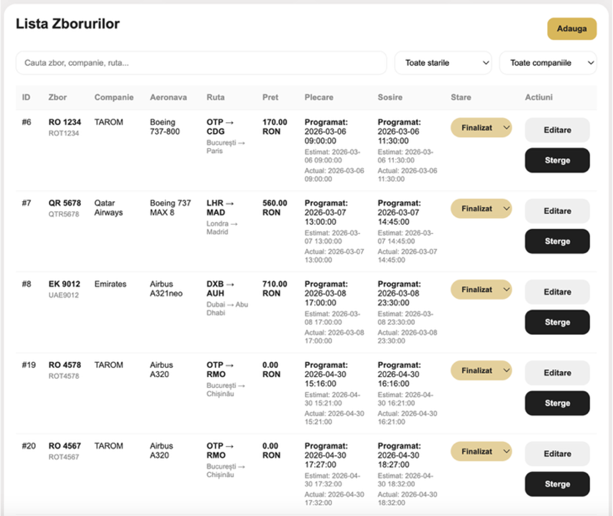

### Flight bookings
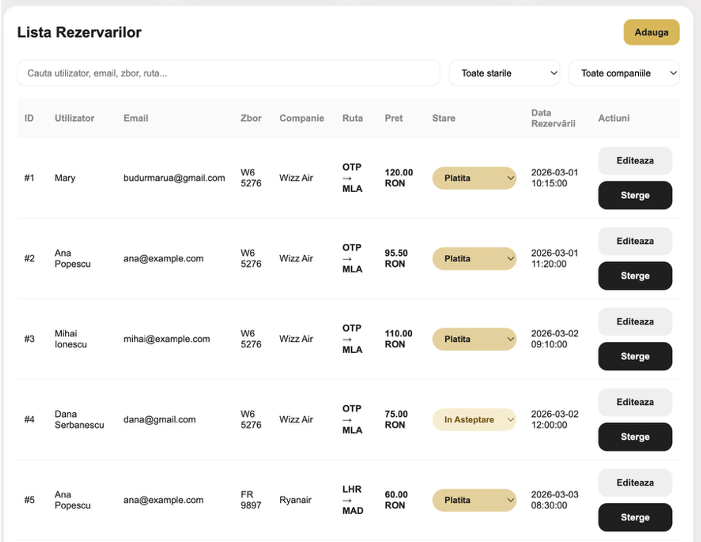

---

- Built a **live analytics dashboard** using **Chart.js**, displaying KPIs such as active/completed flights, total revenue, ticket sales, and popular routes.

### Dashboard
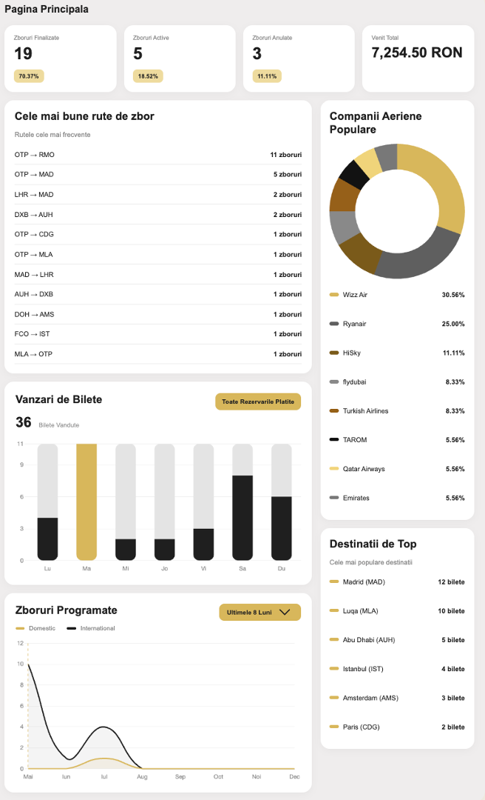

---

- Developed **live flight tracking** on an interactive **Leaflet.js** map.

### Flight Tracking
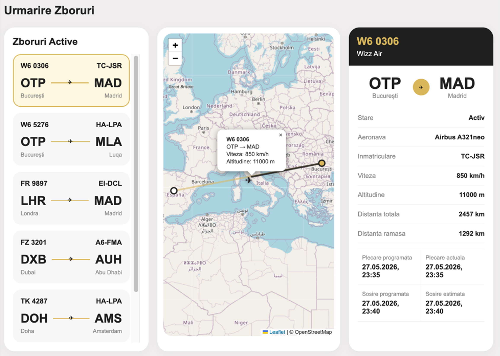

---

- Designed a **telecommunications monitoring module** for recording signal strength, latency, bandwidth, packet loss, and connection status.

### Telecommunications
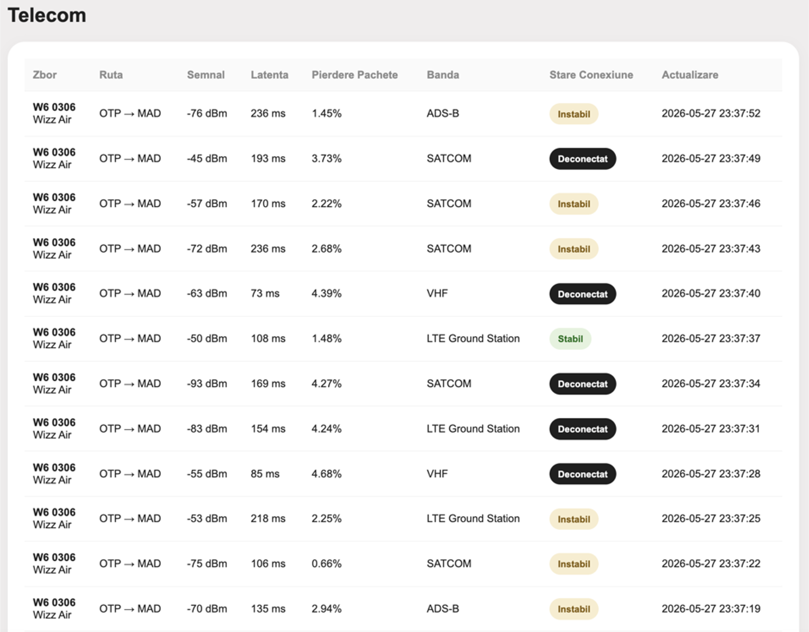

---

- Implemented a **radar monitoring module** using an interactive **Leaflet.js** map, where radar stations and aircraft are displayed, while calculating distance, azimuth, and detection status based on the coordinates of both the aircraft and the selected radar station.

### Radar
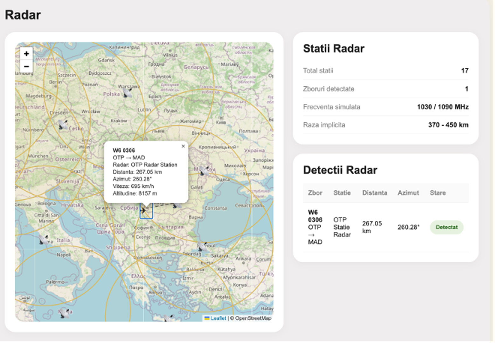

---

- Developed a **Random Forest Machine Learning model** to predict flight delays, delay probability, and operational risk.

### AI Predictions
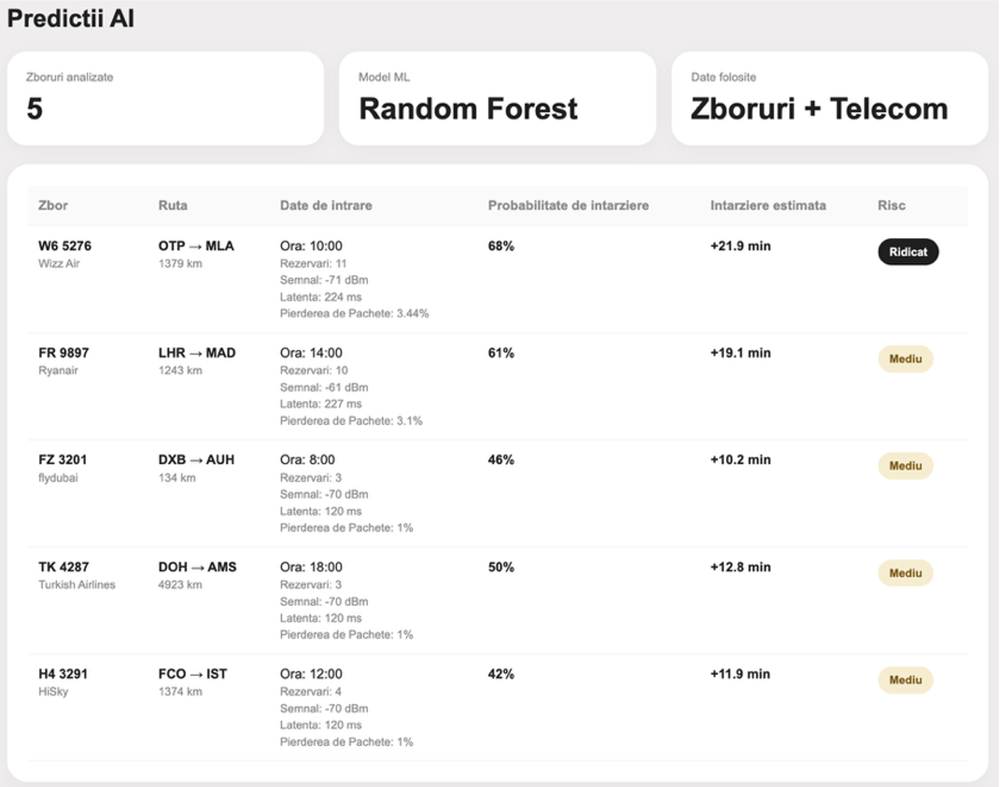

---

- Implemented an **Autoencoder Neural Network** for anomaly detection.

### Anomaly Detection
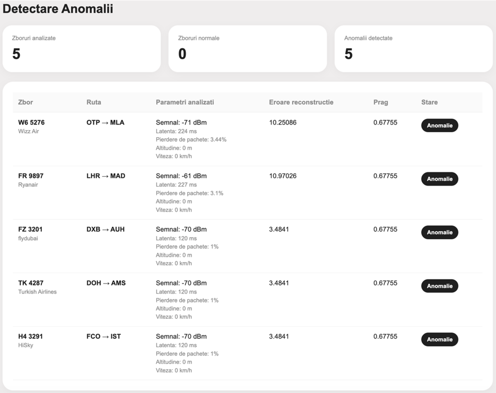

---

- Integrated a **Llama 3.1 virtual assistant** capable of answering questions about flights, airlines, offers, and application data.

### Chatbot
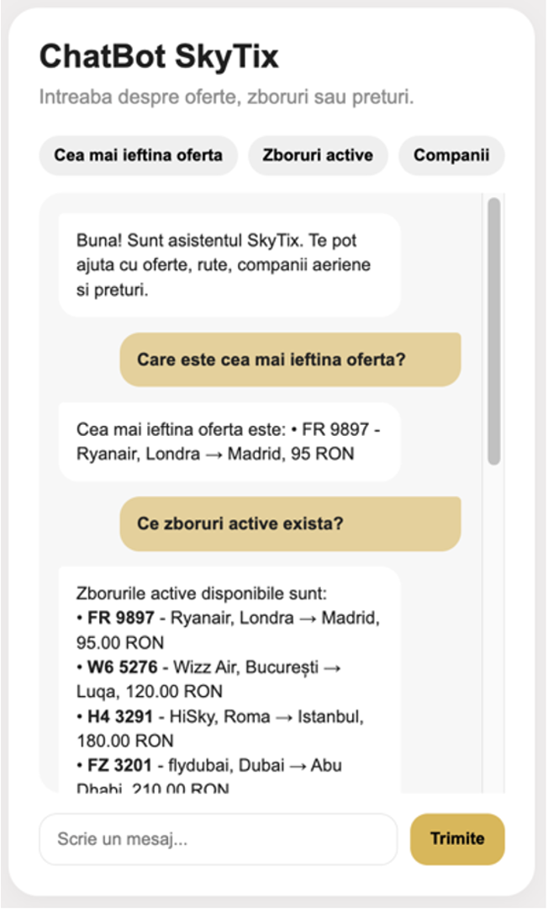

---

- Implemented **real-time notifications** for aircraft position updates, bookings, radar detections, telemetry events and automatic flight status changes.

### Notifications
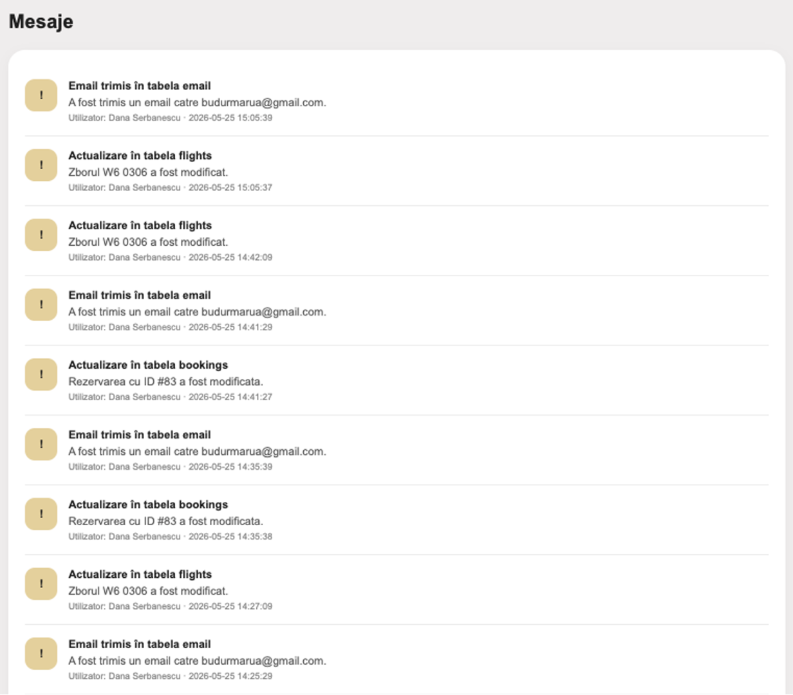

---

- Developed an **automated alert system** for delays, anomalies and cancellations.

### Alerts
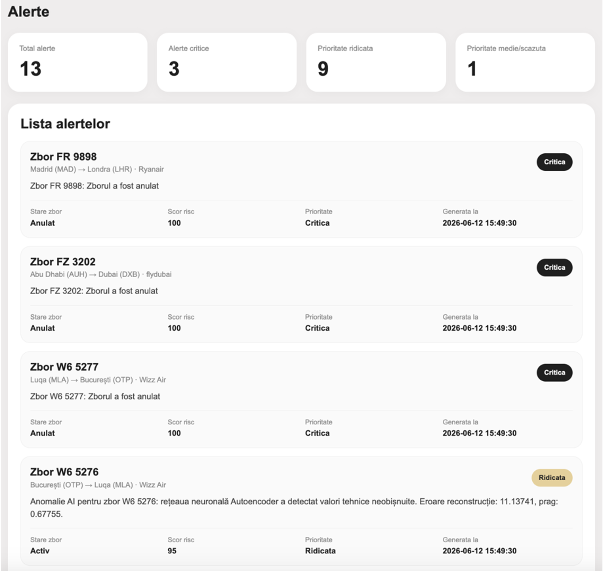

---

- Implemented **email notifications** using **PHPMailer**.

### Email Notifications
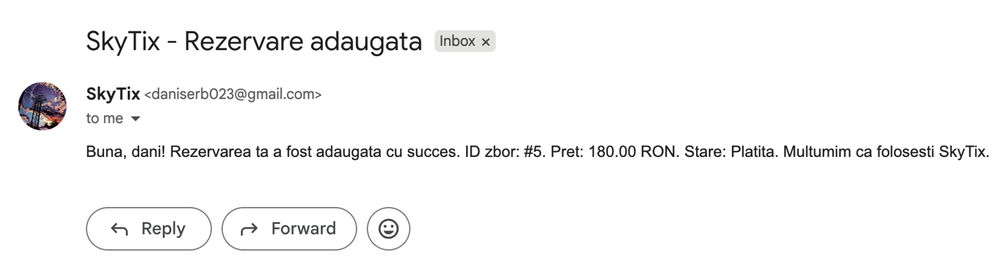
